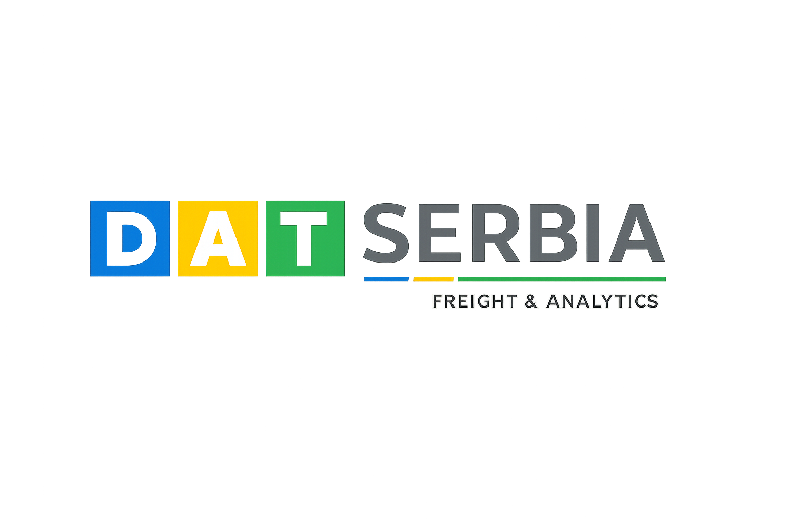

# DAT Freight & Analytics Srbija

---

## Opis

DAT Freight & Analytics Srbija je sveobuhvatna platforma za povezivanje tereta i upravljanje logistikom, dizajnirana specijalno za srpsko tržište transporta. Naša aplikacija povezuje brokere tereta sa prevoznicima kako bi se unapredio proces pronalaženja, nudjenja i prevoza tereta širom Srbije i šire.

### Ključne Funkcionalnosti

- **Upravljanje Teretima**: Brokeri mogu lako postavljati terete sa detaljnim informacijama uključujući lokacije preuzimanja/isporuke, težinu, tip robe i cenu.
- **Upravljanje Vozilima i Flotom**: Prevoznici mogu registrovati i upravljati svojim voznim parkom i prikolicama, prateći dostupnost i kapacitet.
- **Povezivanje Tereta u Realnom Vremenu**: Inteligentni sistem povezuje dostupna vozila sa teretima na osnovu lokacije, tipa opreme i kapaciteta.
- **Sistem Ponuda i Pregovaranja**: Prevoznici mogu slati konkurentne ponude za terete, omogućavajući transparentno pregovaranje o ceni između brokera i prevoznika.
- **Dodela i Praćenje Tereta**: Besprekorna dodela tereta vozilima sa mogućnošću praćenja u realnom vremenu tokom celog procesa isporuke.
- **Profili Kompanija**: Sveobuhvatno upravljanje kompanijama sa podrškom za različite tipove kompanija (brokeri, prevoznici, logistički pružaoci usluga).
- **Bezbedna Autentifikacija**: JWT-bazirani sistem autentifikacije koji obezbeđuje bezbedan pristup za sve korisnike.

### Za Koga je Namenjen?

- **Brokeri Tereta**: Kompanije i pojedinci koji žele da postavljaju terete i pronađu pouzdane prevoznike za transport svojih rob.
- **Prevoznici i Vlasnici Kamiona**: Transportne kompanije koje žele da maksimiziraju iskorišćenost svoje flote pronalaženjem dostupnih tereta.
- **Logistički Pružaoci Usluga**: Kompanije za punu logističku uslugu koje upravljaju i robom i transportnim resursima.

### Prednosti

- Smanjenje praznih kilometara i povećanje iskorišćenosti flote
- Proširenje mreže prevoznika i brokera
- Pristup podacima o teretima i kapacitetima kamiona u realnom vremenu
- Unapređenje procesa davanja ponuda i rezervacije
- Poboljšanje operativne efikasnosti digitalnim upravljanjem teretima
- Unapređenje vidljivosti i praćenja u celom lancu snabdevanja

DAT Freight & Analytics Srbija osnažuje srpsku transportnu industriju modernim digitalnim alatima za efikasniji, pouzdaniji i profitabilniji transport tereta.